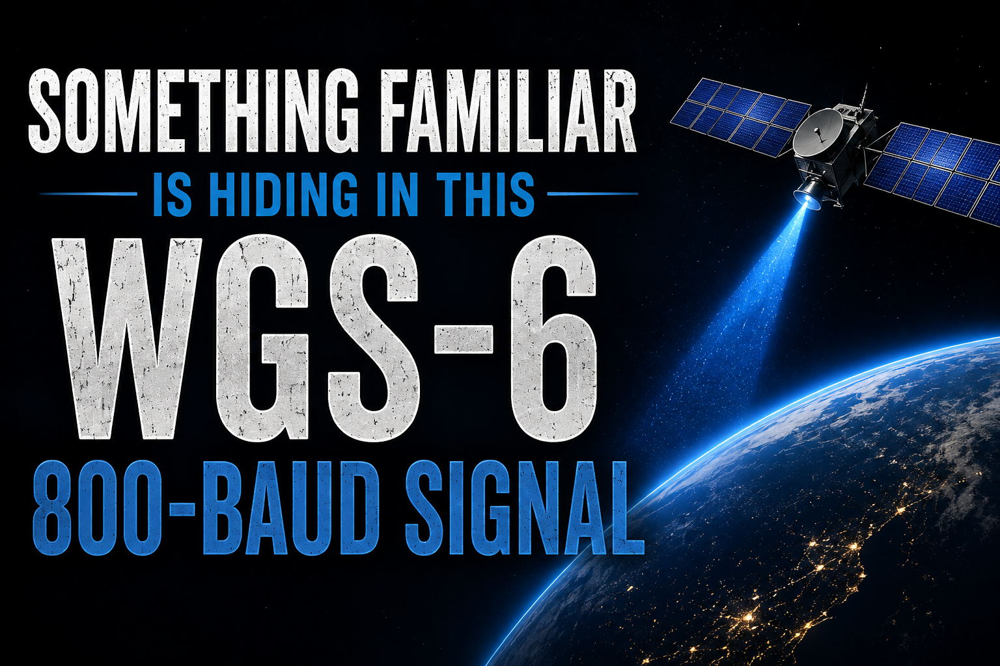
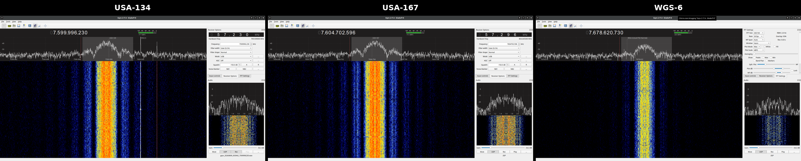
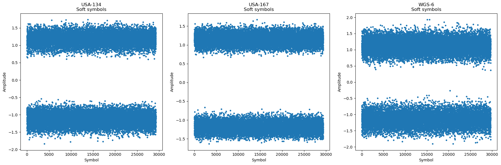
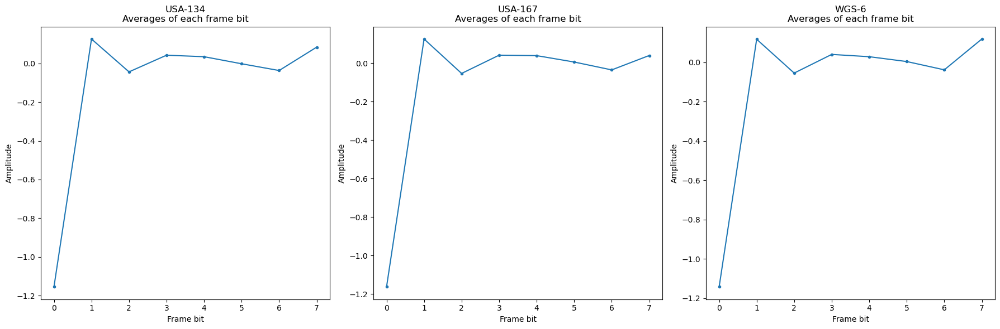
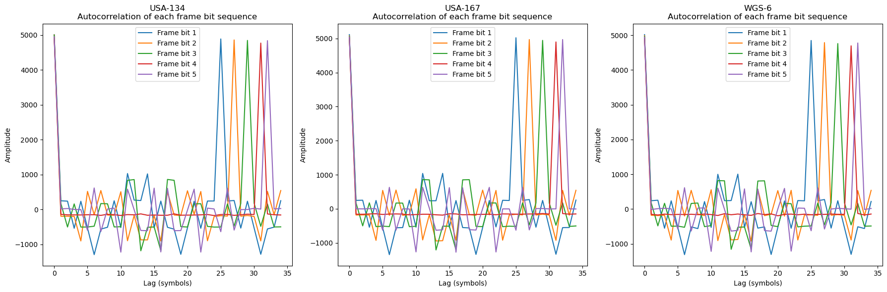
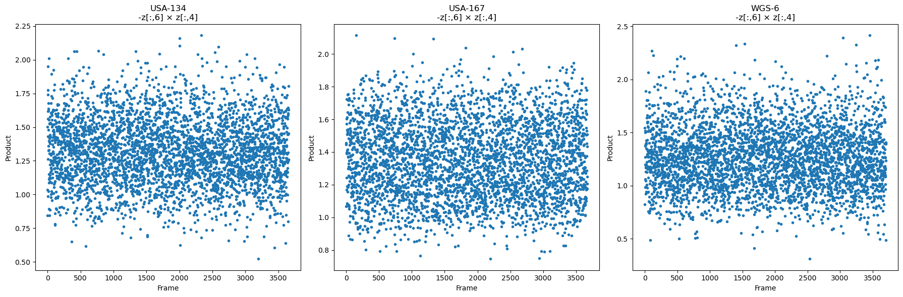
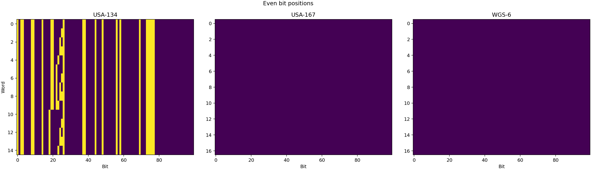
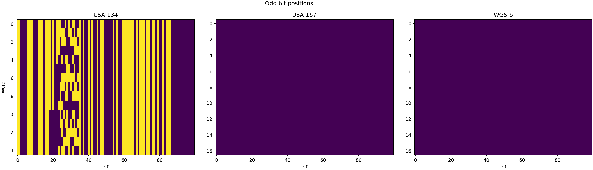

# Something Familiar Is Hiding in This WGS-6 800-Baud Signal



This started with a DSCS-III beacon, a 1992 thesis, and Daniel Estévez's 2020 analysis of one of my USA-167 recordings.

It ended with a much newer spacecraft — **WGS-6** — producing a signal whose framing looks strikingly familiar.

---

## 1. Where this started: Dani's 2020 DSCS-III work

In June 2020, Daniel Estévez analyzed recordings I had made of the X-band beacon from **DSCS-III-A3 / USA-167**.

His work used James Coppola's 1992 AFIT thesis describing the DSCS III satellite control telemetry beacon and its General Purpose Modem decoder.

Dani showed that the central beacon signal is an **800-baud BPSK stream organized into 8-bit frames**.

The structure he recovered included:

- a constant synchronization channel;
- five repeating frame-bit sequences with periods **25, 27, 29, 31 and 32 frames**;
- an inverse relationship between frame bits 6 and 4;
- telemetry carried in the final channel;
- and, importantly, a difference from the thesis description: on USA-167 the telemetry relationship matched **channel 3**, not channel 2.

Dani's original analysis is here:

**[A look at the DSCS-III X-band beacon — Daniel Estévez, 20 June 2020](https://destevez.net/2020/06/a-look-at-the-dscs-iii-x-band-beacon/)**

That work gave us a very distinctive RF fingerprint for the DSCS-III SCT beacon.

---

## 2. Returning to USA-134 and USA-167

A few years later I returned to the DSCS-III spacecraft while working on automated X-band tracking.

USA-134 was still transmitting the older beacon format remarkably cleanly.

When I revisited the two spacecraft more recently, they were no longer behaving identically.

**USA-134 was still carrying recognizable legacy telemetry data. USA-167 was still transmitting the characteristic 800-baud beacon structure, but the legacy telemetry payload no longer appeared to be present.**

That gave me two very useful reference cases:

```text
USA-134: framing + active legacy telemetry
USA-167: framing still present, telemetry effectively absent
```

I documented that recent comparison here:

**[USA-134 / USA-167 observations on X](https://x.com/coastal8049/status/2083771412364571094)**

These signals also became useful torture-test targets while I was developing and debugging my automated tracking system.

The important point, however, is that **USA-167 had not always looked this way**.

Back in 2020, the USA-167 recordings I sent Dani contained the old-school telemetry described in Coppola's thesis. Dani was able to recover the 200-bit encoded frames, separate the even data bits from the odd convolutional-code bits, and identify the BCD spacecraft clock advancing in two-second steps. That is a direct observational baseline showing that **USA-167 itself once carried the recognizable legacy telemetry format**.

My original 2020 observation is still here:

**[USA-167 X-band beacon observation, June 2020](https://x.com/coastal8049/status/1272305942286102528)**

And Dani's detailed analysis of those recordings is here:

**[A look at the DSCS-III X-band beacon — Daniel Estévez, 20 June 2020](https://destevez.net/2020/06/a-look-at-the-dscs-iii-x-band-beacon/)**

That historical comparison turns out to matter a great deal later in this story.

---

## 3. The signal that had been sitting in the background

Several years ago I had also noticed an approximately **800-baud BPSK signal from WGS-6**.

WGS is the successor to DSCS. At the time, the resemblance was interesting, but I did not pursue it much further.

Here are the three signals as received during the current comparison work:



From left to right: **USA-134**, **USA-167**, and **WGS-6**.

Visually, the signals are already suggestive. But similarity in a waterfall is not enough.

The useful question is whether the recovered symbol streams have the same internal structure.

---

## 4. Today: run all three through the same analysis

I took the WGS-6 recording and processed it using the same style of analysis Dani had used on USA-167.

Then I ran **USA-134, USA-167, and WGS-6 side-by-side through the same Jupyter notebook**.

The point was to keep the comparison apples-for-apples: same analysis, same plots, three spacecraft.

The notebook used here is included in this repository:

**[`notebooks/Dani_800baud_three_spacecraft_apples_to_apples.ipynb`](notebooks/Dani_800baud_three_spacecraft_apples_to_apples.ipynb)**

### 4.1 Recovered soft symbols

The first comparison is simply the recovered 800-baud soft-symbol streams.



All three datasets produce clean enough symbol streams to permit the same framing analysis.

---

### 4.2 Eight-bit frame structure

Next, the symbols are arranged into 8-bit frames and the average value of each frame position is examined.



The three spacecraft show the same broad frame organization, including the strongly persistent frame position used to establish alignment.

This is the first strong indication that the WGS-6 signal is not merely another unrelated 800-baud BPSK waveform.

---

### 4.3 The distinctive repeating sequences

The most revealing comparison is the autocorrelation of frame bits 1 through 5.



This is the fingerprint.

The same family of repeating sequences appears in the three spacecraft, with the characteristic periods:

**25, 27, 29, 31 and 32 frames.**

Those are the same periods associated with the DSCS-III SCT beacon architecture described in the historical documentation and recovered by Dani from USA-167.

Seeing those same five sequence lengths in WGS-6 is much stronger evidence than simply observing a similar baud rate or spectral shape.

---

### 4.4 The inverse-channel relationship

Dani's analysis also identified the expected inverse relationship between frame bit 6 and frame bit 4.

The same test can be applied directly to all three recordings:



Again, WGS-6 follows the same framing family.

---


### 4.5 Even and odd bits: the part of the comparison that changes the story

Separating the recovered 200-bit candidate words into their even and odd bit positions makes the relationship between the three spacecraft much easier to see.

Dani showed in 2020 that, for the legacy DSCS-III telemetry, the **even bits are the 100 actual data bits**, while the **odd bits are the additional bits produced by the systematic rate-1/2 convolutional encoder**.

#### Even bit positions — the data bits



#### Odd bit positions — the convolutional-code bits



This is where the comparison becomes more than simply "DSCS looks like WGS."

**USA-134 stands apart.** Its even-bit data field remains visibly populated and structured in the way expected from the legacy telemetry described in Coppola's thesis and demonstrated by Dani in 2020.

**USA-167 and WGS-6, by contrast, now look remarkably similar to one another.** Both retain the characteristic SCT-family framing machinery, but neither shows the populated legacy telemetry field that is still plainly visible on USA-134.

That observation becomes much more significant when the 2020 USA-167 recording is brought back into the picture.

In Dani's 2020 analysis of my USA-167 data, the legacy telemetry was absolutely present. He separated the even and odd bits, recovered the systematic telemetry data, and identified the clock field incrementing correctly. In other words:

```text
USA-167 in 2020: SCT framing + recognizable legacy telemetry
USA-167 today:   SCT framing + legacy telemetry effectively absent
USA-134 today:   SCT framing + recognizable legacy telemetry
WGS-6 today:     SCT-family framing + legacy telemetry effectively absent
```

So USA-167 is not merely an old DSCS spacecraft that happens to resemble WGS-6.

**We have observational evidence that the same spacecraft changed from the old telemetry presentation seen in 2020 to the present configuration that now resembles WGS-6.**

That makes USA-167 the key bridge in the story.

USA-134 appears to preserve what looks like the older SCT telemetry configuration. USA-167 demonstrates that a DSCS-III spacecraft can retain the underlying 800-baud SCT framing while the recognizable legacy telemetry content disappears. WGS-6 then presents the same broad structural behavior seen on present-day USA-167.

The evidence therefore points less toward "WGS simply copied the old USA-134 beacon unchanged" and more toward **continuity and evolution of the SCT signaling architecture**.

The framing machinery survived. The payload presentation changed.

And we can see that transition observationally on USA-167 itself.

---

### 4.6 A system that was supposed to be transitional

There is another historical wrinkle that makes this persistence particularly interesting.

A **1999 National Security Space Road Map** entry for the Single Channel Transponder System described SCTS as an *interim* system intended to bridge AFSATCOM and Milstar. More strikingly, the roadmap stated that **DSCS was not planning to support strategic communications beyond 2003**, with strategic ground systems expected to transition to EHF.

The archived roadmap entry is available here:

**[1999 National Security Space Road Map — Single Channel Transponder System](https://www.globalsecurity.org/space/library/report/1999/nssrm/initiatives/scts.htm)**

That document does not say that every SCT waveform or implementation would physically disappear in 2003. It describes the planned transition of the strategic communications mission. But it establishes the historical expectation: **SCTS was a bridge, not something expected to remain an enduring architecture deep into the WGS era.**

That is why the WGS-6 observation is interesting.

More than two decades after that planned transition point, the distinctive 800-baud SCT-family framing is still observable — now on WGS-6.

---

## 5. What the comparison shows

Taken together, the comparison shows that the WGS-6 800-baud signal is not just superficially similar to the older DSCS-III beacons.

At the framing level, it reproduces the distinctive architecture:

- **8-bit framing**
- **25-frame sequence**
- **27-frame sequence**
- **29-frame sequence**
- **31-frame sequence**
- **32-frame sequence**
- **inverse channel relationship**
- **the same higher-level synchronization behavior**
- and the same channel-3 masking relationship previously observed on USA-167

The result is therefore:

> **The WGS-6 800-baud signal is compatible at the framing level with the distinctive DSCS-III SCT beacon architecture documented in the 1992 thesis and demonstrated by Dani on USA-167 in 2020.**

The interesting part is not merely the continuity between DSCS and WGS.

It is that **USA-167 gives us an observed transition within the DSCS generation itself**. In 2020 it carried the legacy telemetry Dani decoded from my recordings. Today that recognizable telemetry is absent, while the underlying framing remains — and the resulting signal looks much more like WGS-6 than like present-day USA-134.

That makes the three-spacecraft comparison especially useful:

```text
USA-134  -> legacy SCT telemetry still visibly populated
USA-167  -> SCT framing retained, legacy telemetry no longer visible
WGS-6    -> same SCT-family framing behavior as present-day USA-167
```

The most plausible reading of the evidence is therefore that the **signaling architecture persisted while its use or payload configuration evolved** across the DSCS-to-WGS transition.

---

## 6. What this does *not* show

There is an important distinction between identifying the framing architecture and identifying the operational content carried by it.

The WGS-6 recording examined here does **not** show active legacy telemetry data.

In this capture, the recovered candidate data field is effectively idle/zero.

So the claim here is about the **signal structure and framing**, not about operational message content.

---

## 7. Reproduce the result

The repository contains both the original receiver recordings and the demodulated soft-symbol files.

### Original WAV recordings

These are the GQRX audio recordings from which the 800-baud streams can be demodulated again:

- **[USA-134 WAV](data/wav/usa134_800baud.wav)**
- **[USA-167 WAV](data/wav/usa167_800baud.wav)**
- **[WGS-6 WAV](data/wav/wgs6_800baud.wav)**

### Demodulated float32 soft symbols

These are the files used directly by the comparison notebook:

- **[USA-134 soft symbols](data/soft_symbols/symbols_800baud_usa134.f32)**
- **[USA-167 soft symbols](data/soft_symbols/symbols_800baud_usa167.f32)**
- **[WGS-6 soft symbols](data/soft_symbols/symbols_800baud_wgs6.f32)**

The `.f32` files contain little-endian 32-bit floating-point soft symbols, one value per recovered 800-baud symbol.

### Run the notebook

```bash
python3 -m pip install -r requirements.txt
jupyter notebook notebooks/Dani_800baud_three_spacecraft_apples_to_apples.ipynb
```

The notebook reads the three soft-symbol files, aligns each signal independently, and reproduces the side-by-side comparisons shown above.

---

## Repository layout

```text
.
├── README.md
├── requirements.txt
├── data
│   ├── soft_symbols
│   │   ├── symbols_800baud_usa134.f32
│   │   ├── symbols_800baud_usa167.f32
│   │   └── symbols_800baud_wgs6.f32
│   └── wav
│       ├── usa134_800baud.wav
│       ├── usa167_800baud.wav
│       └── wgs6_800baud.wav
├── images
│   ├── title.png
│   ├── waterfall_comparison.png
│   ├── waterfall_usa134.png
│   ├── waterfall_usa167.png
│   ├── waterfall_wgs6.png
│   ├── notebook_soft_symbols.png
│   ├── notebook_frame_bit_averages.png
│   ├── notebook_frame_bit_autocorrelation.png
│   └── notebook_inverse_channel.png
└── notebooks
    └── Dani_800baud_three_spacecraft_apples_to_apples.ipynb
```

---

## Bottom line

The story began with a Cold War-era DSCS-III beacon and a 2020 reverse-engineering effort.

In 2020, **USA-167 still carried the old telemetry that Dani decoded from my recordings**. Today it no longer does, even though the underlying 800-baud framing remains. **USA-134 still preserves that older telemetry presentation.**

WGS-6, meanwhile, looks much more like present-day USA-167 than it does USA-134.

That turns USA-167 into the missing link in the comparison: direct observational evidence that the old SCT framing can remain while the legacy telemetry presentation changes.

A system described in the late 1990s as an interim bridge to Milstar — and associated with a strategic communications mission expected to transition away from DSCS after 2003 — has left a remarkably persistent RF fingerprint.

**Something familiar really was hiding in WGS-6.**
